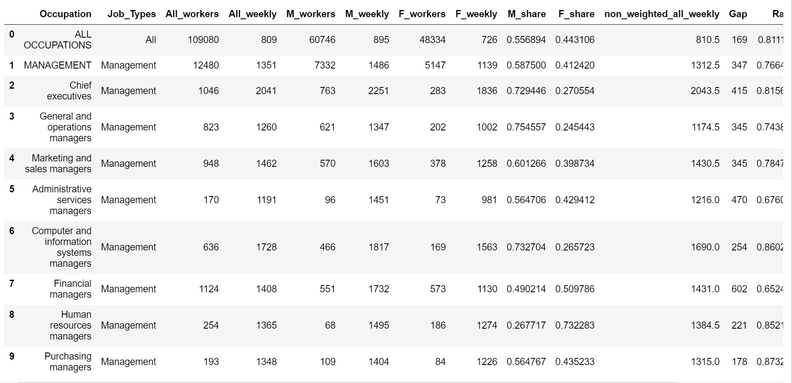
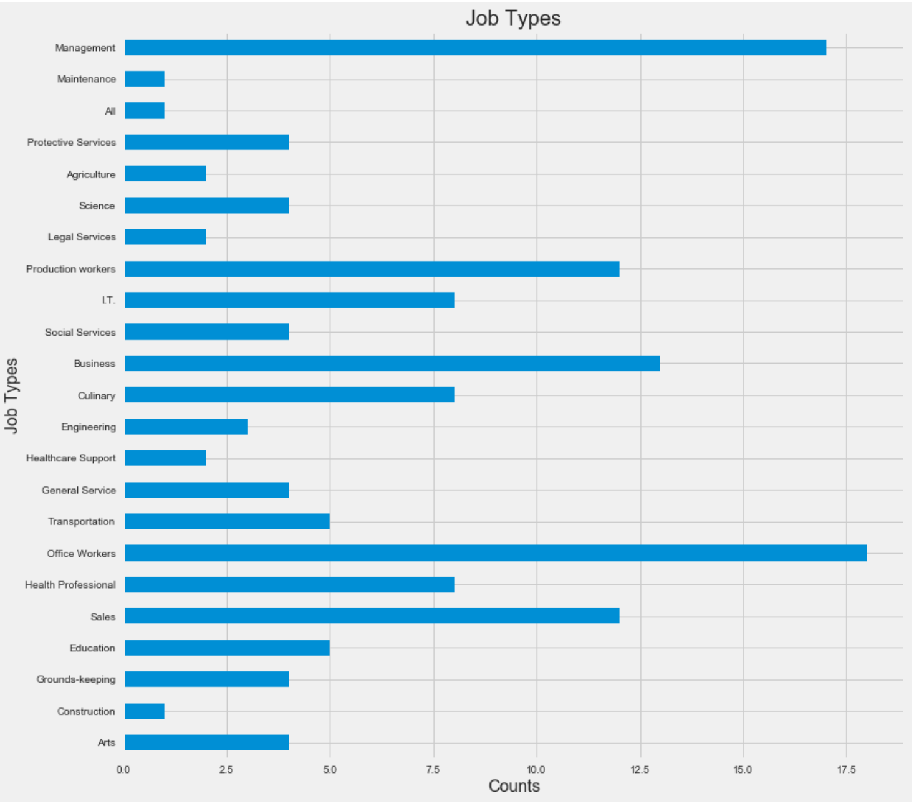
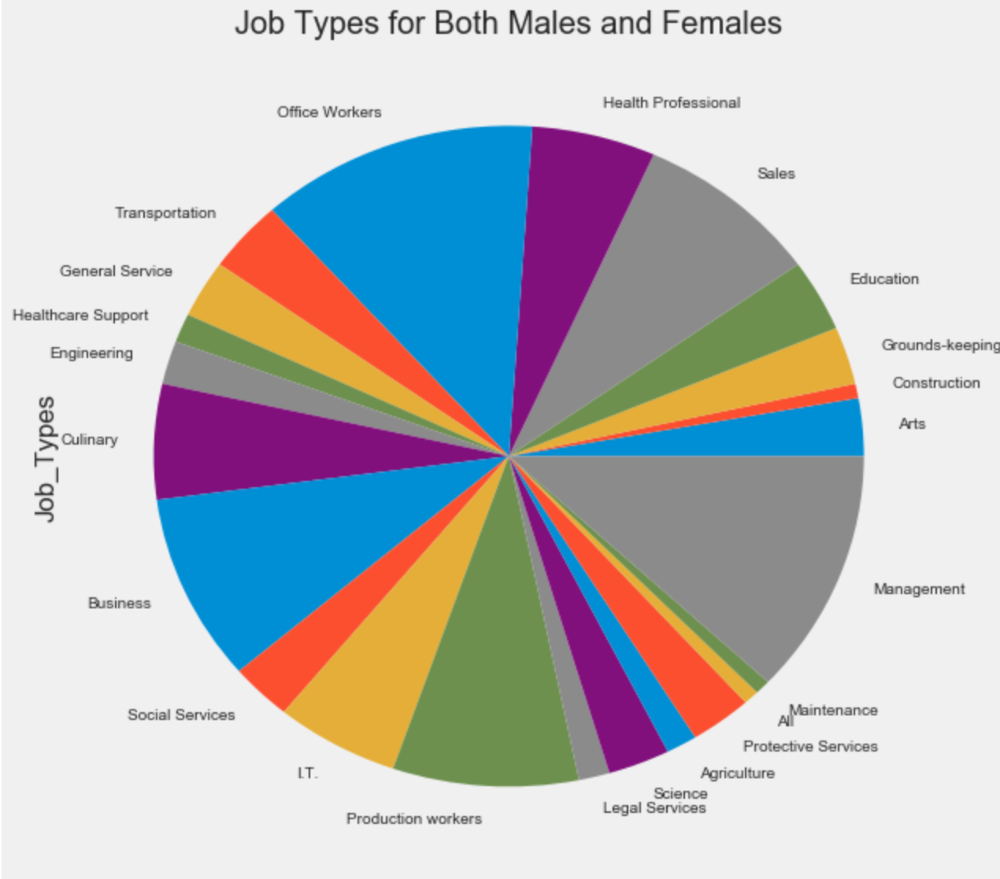
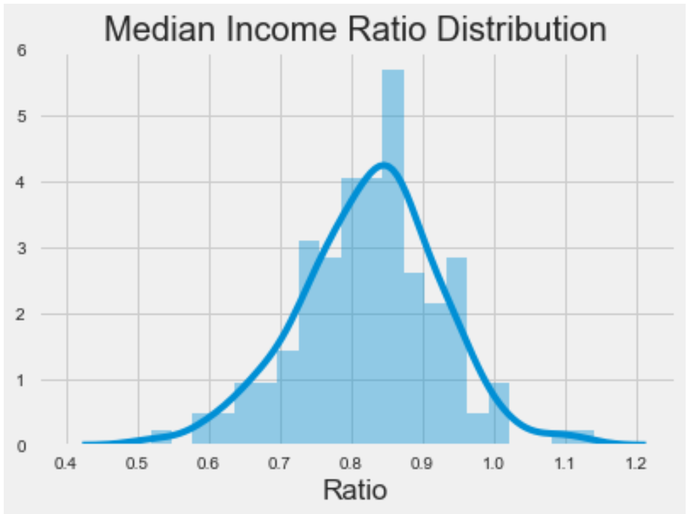
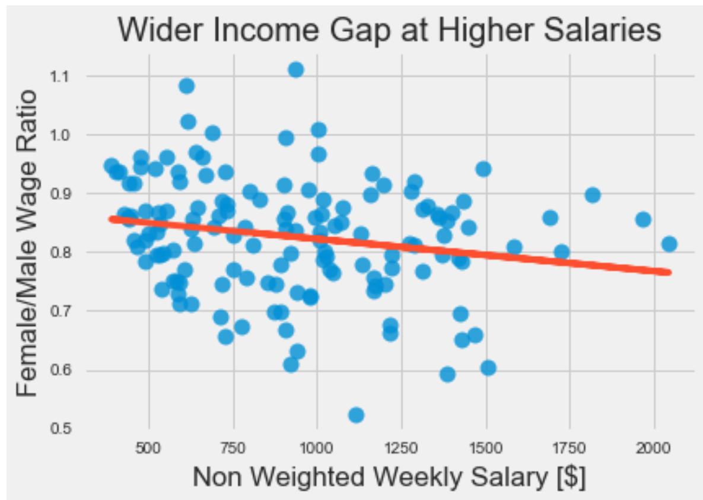
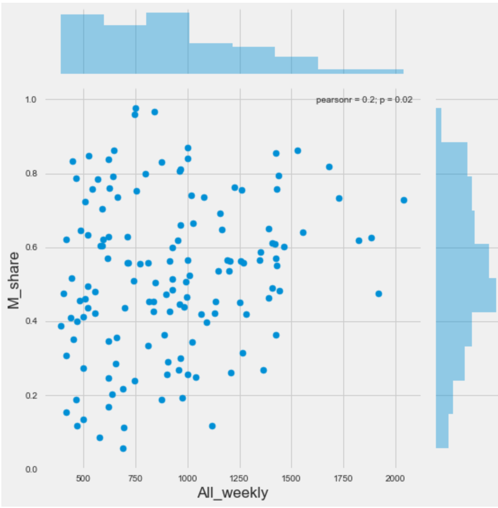
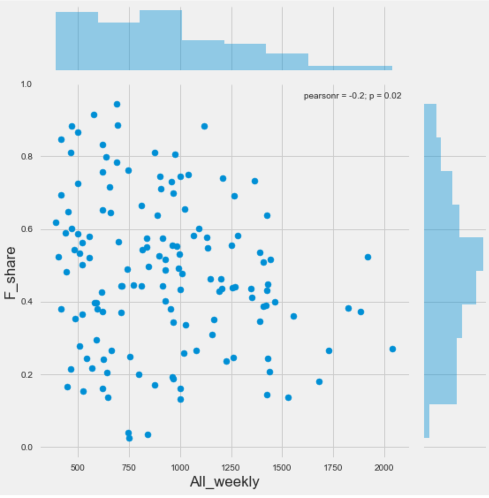
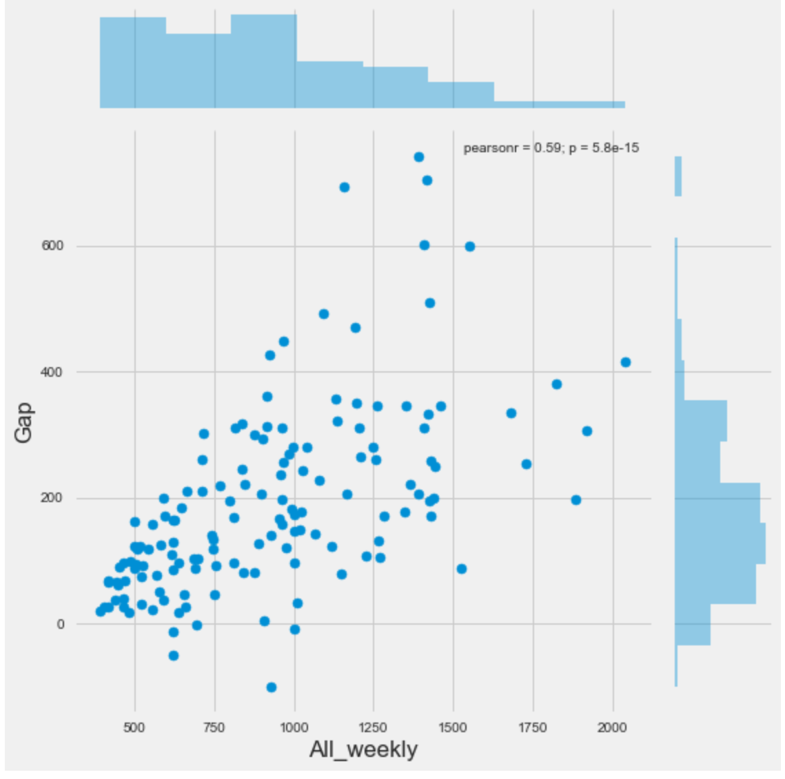

# GENDER INCOME GAPS IN THE UNITED STATES

## SEMESTER AND CLASS TITLE

Fall 2017, DATA 550 Data Visualization - Dr. Bora Pajo

## DESCRIPTION AND CONTEXT

The gender pay gap in the United States is the ratio of female-to-male median yearly earnings among full-time, year-round workers. While many believe that the gender gap is overstated in the United States. This analysis attempts to show if the gender gap does exist accross various industries. The extent to which discrimination plays a role in explaining gender wage disparities is somewhat difficult to quantify, due to a number of potentially confounding variables. 

A 2010 research review by the majority staff of the United States Congress Joint Economic Committee reported that studies have consistently found unexplained pay differences even after controlling for measurable factors that are assumed to influence earnings – suggestive of unknown/unmeasurable contributing factors of which gender discrimination may be one.[7] Other studies have found direct evidence of discrimination – for example, more jobs went to women when the applicant's sex was unknown during the hiring process.

Analysis thus far has found that there is indeed a sizable gender gap between male and female incomes.


Figure: Women's earnings as a percentage of men's earnings, by state and Puerto Rico, 2007. Data from the Income, Earnings, and Poverty Data From the 2007 American Community Survey.

Source: US Census Bureau

## ABOUT THE DATA

This dataset, retrieved from the Bureau of Labor Statistics, shows the median weekly incomes for 535 different occupations. The data encompasses information for all working American citizens as of January 2015. The incomes are broken into male and female statistics, preceded by the total median income when including both genders. The data has been re-formatted from the original PDF-friendly arrangement to make it easier to clean and analyze.


Using pandas, numpy, seaborn, and matplotlib 
Created bar chart, pie chart, boxplot, strip plot, violin plot, and kdeplot 

## DATA SOURCE 

Bureau of Labor Statistics - https://www.bls.gov/

The Bureau of Labor Statistics (BLS) is a Federal government agency and everything published, both in hard copy and electronically, is in the public domain, except for previously copyrighted photographs and illustrations. 

This dataset has been converted to CSV

## AUTHOR'S NAME AND CONTACT

Oddinigwe Onyemenem - oddinigwe@gmail.com


## CONTENT

### Fields in the dataset:

Median weekly earnings of full-time wage and salary workers by detailed occupation and sex.

Occupation: Job title as given from BLS. Industry summaries are given in ALL CAPS.

All_workers: Number of workers male and female, in thousands.

All_weekly: Median weekly income including male and female workers, in USD.

M_workers: Number of male workers, in thousands.

M_weekly: Median weekly income for male workers, in USD.

F_workers: Number of female workers, in thousands.

F_weekly: Median weekly income for female workers, in USD.

## INPUTS AND OUTPUTS

```
#LOAD ALL APPLICABLE TOOLS

#to enable visualizations 
%matplotlib inline
# linear algebra
import numpy as np 
# data processing, CSV file I/O 
import pandas as pd 
import matplotlib.pyplot as plt
#Python visualization library for statistical data visualization 
import seaborn as sns
plt.style.use('fivethirtyeight')
from subprocess import check_output
from sklearn.linear_model import LinearRegression
from sklearn.preprocessing import StandardScaler
from sklearn.model_selection import train_test_split
```
```
# Next, load the data and add some relevant features such as:
# the wage ratio, gap and share of each genders (or sexes) in the field

# Load the data
df = pd.read_csv('C:\\Users\\oddin\\Desktop\\US_Income\\inc_occ_gender.csv')

# Create dataframes for relevant features to use in the analysis and visualization
df = df[~(df.M_weekly == 'Na')]
df = df[~(df.F_weekly == 'Na')]
       
df['M_weekly'] = df.M_weekly.apply(lambda x: int(x))
df['F_weekly'] = df.F_weekly.apply(lambda x: int(x))
df['M_workers'] = df.M_workers.apply(lambda x: int(x))
df['F_workers'] = df.F_workers.apply(lambda x: int(x))
df['All_weekly'] = df.All_weekly.apply(lambda x: int(x))
df['All_workers'] = df.All_workers.apply(lambda x: int(x))
df['M_share'] = df.M_workers/df.All_workers 
df['F_share'] = df.F_workers/df.All_workers 
df['non_weighted_all_weekly'] = (df.M_weekly + df.F_weekly)/2
df['Gap'] = df.M_weekly - df.F_weekly
df['Ratio'] = df.F_weekly/df.M_weekly
df['Ratio_of_workers'] = df.F_workers/df.M_workers

df = df.reset_index(drop = True)

# Show the first 15 rows of the dataset
df.head(15)

```


```
# to count the frequency of values for job types
df["Job_Types"].value_counts()

# COUNTS OUTPUT
Office Workers         18
Management             17
Business               13
Production workers     12
Sales                  12
Health Professional     8
I.T.                    8
Culinary                8
Transportation          5
Education               5
Social Services         4
Science                 4
General Service         4
Protective Services     4
Grounds-keeping         4
Arts                    4
Engineering             3
Legal Services          2
Healthcare Support      2
Agriculture             2
Maintenance             1
All                     1
Construction            1
Name: Job_Types, dtype: int64
```
```
#To create a bar chart showing counts for the job types 
fig,ax = plt.subplots(figsize=(12,12))
df['Job_Types'].value_counts(sort=False).plot(kind='barh')
plt.title('Job Types',fontsize=20)
plt.xlabel('Counts',fontsize=16)
plt.ylabel('Job Types',fontsize=16)
```


```
#To create a pie chart showing all the job types for all genders
fig,ax = plt.subplots(figsize=(9,9))
df['Job_Types'].value_counts(sort=False).plot(kind='pie')
plt.title('Job Types for Both Males and Females',fontsize=20)
```


```
# To show the distribution of the wage gap:
sns.distplot(df.Ratio, bins = np.linspace(0.4,1.2,28))
plt.title('Median Income Ratio Distribution')
np.mean(df.Ratio)
```


```
# To show the income gap at higher salaries using the female/male wage ratio and non weighted weekly salary
plt.plot(df.non_weighted_all_weekly, df.Ratio,'o',markersize = 10, alpha = 0.8)
plt.xlabel('Non Weighted Weekly Salary [$]')
plt.ylabel('Female/Male Wage Ratio')
plt.title('Wider Income Gap at Higher Salaries')

x = df.non_weighted_all_weekly
y = df.Ratio
fn = np.polyfit(x,y,1)
fit_fn = np.poly1d(fn) 
plt.plot(x,fit_fn(x))
```


```
# Creating a basic regression model to understand the importance of the different features.
# First, use salaries of males and females as a function of the non-normalized field salary:
# i.e. the average of the males and females median salary:

plt.plot(df.non_weighted_all_weekly, df.M_weekly,'o')
plt.plot(df.non_weighted_all_weekly, df.F_weekly,'o')
plt.legend(['Males','Females'])
plt.xlabel('Field Median Salary')
plt.ylabel('Salary')
plt.show()
```


```
#Use the seaborn library to create seaborn jointplot
#Two kinds of distribution in one visualization i.e. bivariate scatterplots and univariate histograms 
sns.jointplot(x="All_weekly", y="M_share", data=df, size=8)
```


This jointplot shows a linear correlation for MALES with regards to higher salaries. There is an increase at higher salary levels
```
```
#Use the seaborn library to create seaborn jointplot
#Two kinds of distribution in one visualization i.e. bivariate scatterplots and univariate histograms 
sns.jointplot(x="All_weekly", y="F_share", data=df, size=8)
```
```


This jointplot does not show a linear correlation for FEMALES. It depicts an inverse relationship at the higher salaries for FEMALES
```
#Use the seaborn library to create seaborn jointplot
#Two kinds of distribution in one visualization i.e. bivariate scatterplots and univariate histograms 
sns.jointplot(x="All_weekly", y="Gap", data=df, size=8)
```


```
This depicts the widening income gaps for both males and females across all industries


